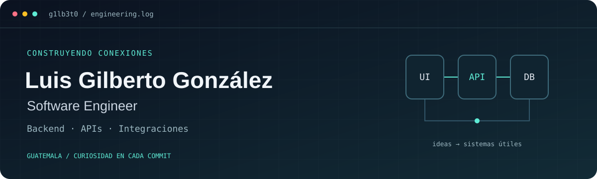

<p align="center">
  
</p>

<p align="center">
  <a href="#tu-recorrido-en-3-minutos">Empieza el recorrido</a> ·
  <a href="#lo-que-aporto">Experiencia</a> ·
  <a href="#mi-caja-de-herramientas">Stack</a> ·
  <a href="#hablemos">Contacto</a> ·
  <a href="#english">English</a>
</p>

# Hola, soy Luis 👋

**Desarrollador de software en Guatemala, enfocado en backend, APIs e integraciones.** Me gusta conectar las piezas: una interfaz, una API, una base de datos y el proceso de negocio que les da sentido.

Mi experiencia combina **integraciones empresariales con Odoo**, desarrollo full-stack y proyectos de sistemas. Estudio **Ingeniería en Ciencia de la Computación y Tecnologías de la Información en la Universidad del Valle de Guatemala**.

```text
$ whoami
Luis Gilberto González / G1LB3T0

$ focus
Backend · APIs · Integraciones · Automatización

$ approach
Entender el problema → construir → verificar → documentar
```

## Tu recorrido en 3 minutos

**¿Vienes a conocer mi trabajo?** Empieza por las integraciones, sigue hacia el producto y termina explorando cómo funcionan las cosas por dentro.

| Parada | Proyecto | Qué puedes explorar |
| :--- | :--- | :--- |
| **01 / Conectar sistemas** | [Chatbot + servidores MCP](https://github.com/G1LB3T0/Proyecto1_Redes_MCP) | Python, JSON-RPC, transportes stdio/HTTPS y un inventario de demostración. Documentación de autenticación, sesiones, despliegue y pruebas. |
| **02 / Construir un producto** | **Freelance Hub** · [Backend](https://github.com/G1LB3T0/Proyecto_Freelance_BackEnd) · [Frontend](https://github.com/G1LB3T0/Proyecto_Freelance_FrontEnd) | React + Vite, API REST con Express, autenticación JWT, PostgreSQL con Prisma y entorno con Docker. |
| **03 / Ver la interfaz en acción** | [Hogar & Decoración](https://github.com/G1LB3T0/Proyecto_Ecommerce) · [Abrir demo ↗](https://proyecto-ecommerce-git-master-g1lb3t0s-projects.vercel.app/) | Frontend de ecommerce con React: catálogo, categorías, fichas de producto y componentes reutilizables. |
| **04 / Mirar bajo el capó** | [Generadores YALex / YAPar](https://github.com/G1LB3T0/Proyecto1_Compis_Generador_Analizador_Lexico) | Proyecto académico grupal: autómatas, generación de lexers, parsers LL(1), SLR(1) y LALR, con una interfaz Flask. |
| **05 / Salir de la ruta** | [RayCube](https://github.com/G1LB3T0/RayCube) | Exploración de gráficos en Rust y Raylib: un cubo 3D, texturas, iluminación y controles de cámara. |

**Si solo tienes un minuto:** abre el [README de MCP](https://github.com/G1LB3T0/Proyecto1_Redes_MCP#readme), revisa su [guía de despliegue](https://github.com/G1LB3T0/Proyecto1_Redes_MCP/blob/main/docs/deployment.md) y prueba la [demo del ecommerce](https://proyecto-ecommerce-git-master-g1lb3t0s-projects.vercel.app/).

## Lo que aporto

**Desarrollador de Software Junior · Octopus Innovations GT**  
Octubre de 2025 – agosto de 2026

- Desarrollé y mantuve integraciones en Python entre **Odoo, certificadores FEL y Meta API**, trabajando con autenticación, solicitudes, respuestas y manejo de errores.
- Personalicé lógica de negocio y flujos de CRM, compras e inventario con **Python, JavaScript/TypeScript y XML/QWeb**.
- Diagnostiqué problemas de integración y preparé datos para migraciones e importaciones masivas.
- Apoyé despliegues y soporte en entornos cloud, utilizando **Git y Docker** dentro del flujo de desarrollo.
- Implementé **MCP y Skills para Codex y Claude Code** en flujos de automatización, soporte y documentación.

## Mi caja de herramientas

| Área | Tecnologías |
| :--- | :--- |
| **Backend y APIs** | Python · TypeScript · JavaScript · Node.js · Express · Flask · REST · JSON/XML |
| **Datos** | PostgreSQL · SQL · Prisma |
| **Frontend** | React · Vite · HTML/CSS · Bootstrap |
| **Integraciones** | Odoo · CRM · FEL · Meta API · XML/QWeb · MCP |
| **Entornos y herramientas** | Docker · Git · GitHub · DigitalOcean · Hetzner · Azure · AWS · Cloudpepper |
| **Fundamentos y exploración** | Java · C++ y Rust en proyectos académicos y personales |

## También hay espacio para jugar

La curiosidad no termina en las APIs. En [Canchon Mod](https://github.com/G1LB3T0/Canchon_Mod) llevo reglas de juego a un servidor de Minecraft con Java y Fabric: eventos, estado persistente y configuración. Y en RayCube exploro el lado visual del código.

Los proyectos académicos y personales son parte de mi aprendizaje. En los trabajos grupales, el historial de commits y los créditos del repositorio permiten consultar las contribuciones de cada integrante.

## Hablemos

Me interesa aportar en proyectos de **backend, APIs, integraciones y desarrollo full-stack**.

📍 Guatemala · 🌐 Español / English B2  
✉️ [luis.yo09@hotmail.com](mailto:luis.yo09@hotmail.com)

<a id="english"></a>
<details>
<summary><strong>For international recruiters · English overview</strong></summary>

### Hi, I'm Luis Gilberto González

I'm a software developer based in Guatemala, focused on **backend development, APIs and business integrations**. I'm studying Computer Science and Information Technology Engineering at Universidad del Valle de Guatemala.

As a **Junior Software Developer at Octopus Innovations GT (October 2025 – August 2026)**, I worked on Python integrations between Odoo and external services, including electronic invoicing providers and the Meta API. My experience also includes business workflow customization, data preparation for migrations, cloud deployment support, and MCP tooling for development workflows.

**Start here:**

- [MCP chatbot](https://github.com/G1LB3T0/Proyecto1_Redes_MCP): Python, JSON-RPC, local and remote transports, deployment documentation and automated checks.
- [Freelance Hub API](https://github.com/G1LB3T0/Proyecto_Freelance_BackEnd) + [React frontend](https://github.com/G1LB3T0/Proyecto_Freelance_FrontEnd): a full-stack project using Express, PostgreSQL, Prisma and Docker.
- [Ecommerce demo](https://proyecto-ecommerce-git-master-g1lb3t0s-projects.vercel.app/): a React interface you can explore immediately.
- [YALex / YAPar](https://github.com/G1LB3T0/Proyecto1_Compis_Generador_Analizador_Lexico): a collaborative academic project covering lexer and parser generation.

**Languages:** Spanish and English B2.  
**Contact:** [luis.yo09@hotmail.com](mailto:luis.yo09@hotmail.com).

</details>

---

<p align="center"><sub>Gracias por pasar por aquí. Cada repositorio es una pieza del recorrido.</sub></p>
